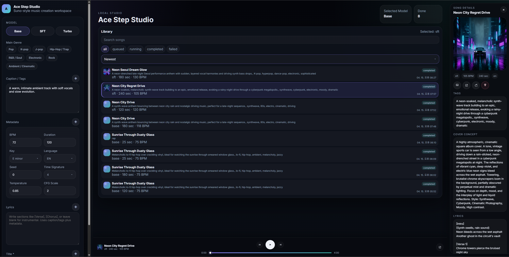

# Ace Step Studio

Suno-style local music generation studio built with ComfyUI, ACE-Step 1.5, and Ollama.



## Features

- ACE-Step 1.5 song generation with `Base`, `SFT`, and `Turbo`
- Ollama-assisted generation for `Caption / Tags`, `Metadata`, `Lyrics`, and `Title`
- genre-guided prompt generation
- local library with playback, hover play, bulk delete, and per-song action menu
- manual audio post-processing with bundled `ffmpeg` (`gain -> loudnorm -> limiter`)
- cover image generation through ComfyUI `flux2_klein`
- clickable cover preview with lightbox view
- local storage with SQLite, audio files, images, and metadata

## Requirements

- Python 3.10+
- Node.js 18+
- ComfyUI
- Ollama

## Environment

Copy `.env.example` to `.env`.

Example:

```env
BACKEND_HOST=127.0.0.1
BACKEND_PORT=8001
VITE_API_HOST=127.0.0.1
VITE_API_PORT=8001
COMFYUI_BASE_URL=http://127.0.0.1:8188
OLLAMA_BASE_URL=http://127.0.0.1:11434
OLLAMA_MODEL=gemma4:e4b
OUTPUT_DIR=./storage/audio
FFMPEG_PATH=
FFPROBE_PATH=
```

## ComfyUI Setup

This project submits workflow JSON directly to ComfyUI through the API.

That means:

- you do **not** need to manually import the workflow in the ComfyUI UI every time
- but your ComfyUI instance **must** have the same required models and custom nodes that the workflow expects

The workflow files used by this app are stored in:

```txt
workflow/
```

Before running the app, verify that your ComfyUI environment can execute the workflows referenced there, including:

- ACE-Step audio workflows
- the `image_flux2_klein_text_to_image.json` cover workflow
- matching model files, VAE files, CLIP files, and any required custom nodes

If ComfyUI is missing a required node or model, generation will fail even if the backend and frontend are running correctly.

## Install

### Python

```powershell
python -m venv .venv
.\.venv\Scripts\Activate.ps1
pip install fastapi uvicorn httpx pydantic
```

### Frontend

```powershell
npm install
```

## Run

### Backend

```powershell
.\start_backend.bat
```

```bash
./start_backend.sh
```

### Frontend

```powershell
npm run dev
```

Frontend:

- `http://127.0.0.1:5173`

Backend:

- `http://127.0.0.1:8001`

Notes:

- `start_backend.bat` reads `BACKEND_HOST` and `BACKEND_PORT` from `.env`, activates `.venv`, and runs the backend in the foreground.
- `start_backend.sh` reads `BACKEND_HOST` and `BACKEND_PORT` from `.env`, activates `.venv`, and runs the backend in the background.
- Frontend API calls read `VITE_API_HOST` and `VITE_API_PORT` from `.env`.

## Bundled ffmpeg

Audio post-processing uses bundled `ffmpeg` and `ffprobe`, not the system PATH.

Place the binaries under:

```txt
bin/ffmpeg/<platform>/
```

Examples:

- `bin/ffmpeg/windows-x64/ffmpeg.exe`
- `bin/ffmpeg/windows-x64/ffprobe.exe`
- `bin/ffmpeg/linux-x64/ffmpeg`
- `bin/ffmpeg/linux-x64/ffprobe`

You can override the bundled paths by setting:

- `FFMPEG_PATH`
- `FFPROBE_PATH`

If these binaries are missing, manual `Post-process` actions in the song detail panel will fail with a descriptive error.

## Storage

All local outputs are stored under `storage/`.

```txt
storage/
+-- app.db
+-- audio/
+-- images/
+-- metadata/
```

## Project Structure

```txt
backend/      FastAPI API, database, ComfyUI/Ollama services
src/          React frontend
workflow/     ComfyUI workflow JSON files
storage/      Local outputs
```
